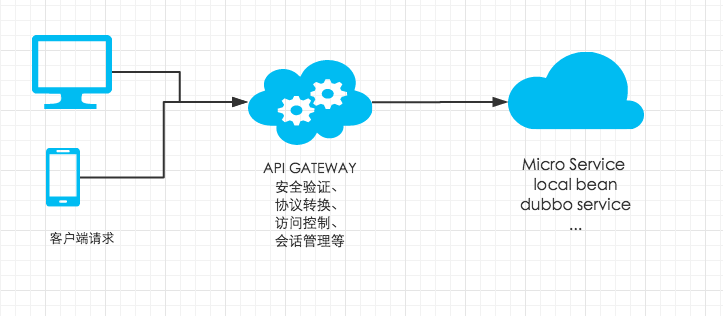

#轻量级的微服务网关jsongood
简单地，上图说明这个轮子的作用:




###jsongood是一个简单可扩展网关框架，支持客户端透明地调用服务端接口，可以在此基础上方便地实现一套微服务网关架构。
##网关目前已有功能:
* 可反射调用本地spring bean;
* 可泛化调用远程dubbo service bean;
* RPC模块支持基于声明式validation
* 支持自定义Filter，完成业务上的安全验证、协议转换、访问控制、会话管理等需求；
* 目前API暴露方式支持Servlet，见ServletRpcServer，当然也可方便扩展至其他通讯架构比如websocket，如需扩展参考DefaultRpcServiceHandler


##服务端使用方式

```

  <!-- jsongood -->
      
        <dependency>
            <groupId>com.github.jessyZu</groupId>
            <artifactId>jsongood-servlet</artifactId>
            <version>1.0.1</version>
        </dependency>

  <!-- validation 可选 -->

  		<dependency>
            <groupId>org.hibernate</groupId>
            <artifactId>hibernate-validator</artifactId>
            <version>4.2.0.Final</version>
        </dependency>

```


```
  @Autowired
    private ServletRpcServer rpcServer;

    @RequestMapping("/gateway")
    void apiGateway(HttpServletRequest request, HttpServletResponse response) throws IOException {
        rpcServer.handle(request, response);
    }


```


##客户端调用方式

###JSON以及JSONP请求
参考[https://github.com/jessyZu/jsongood/blob/master/jsongood-demo/src/main/resources/static/test.htm](https://github.com/jessyZu/jsongood/blob/master/jsongood-demo/src/main/resources/static/test.htm)

###android客户端请求
参考[https://github.com/jessyZu/jsongood-android-client/blob/master/jsongood-android/src/androidTest/java/com/github/jessyzu/jsongood/RpcManagerTests.java](https://github.com/jessyZu/jsongood-android-client/blob/master/jsongood-android/src/androidTest/java/com/github/jessyzu/jsongood/RpcManagerTests.java)

```
  manager.invoke("com.github.jessyZu.jsongood.demo.api.DemoService:sayHello1:1.0.0", new Object[]{p1, p2, new Param[]{p1, null}}, new RpcCallback() {
            @Override
            public void success(RpcResult result) {
                if (result.isSuccess()) {
                    Param data = result.dataToObject(Param.class);
                    boolean isMainThread = Looper.myLooper() == Looper.getMainLooper();
                    Log.i(RPCConstants.JSONGOOD_LOG_FLAG, data.toString());

                }
                signal.countDown();
            }

            @Override
            public void failure(Request request, Response response, IOException e) {
                signal.countDown();
                fail();
            }


```

###IOS客户端请求
后续有时间会提供pod出来，目前不想维护oc版本，直接上swift吧

